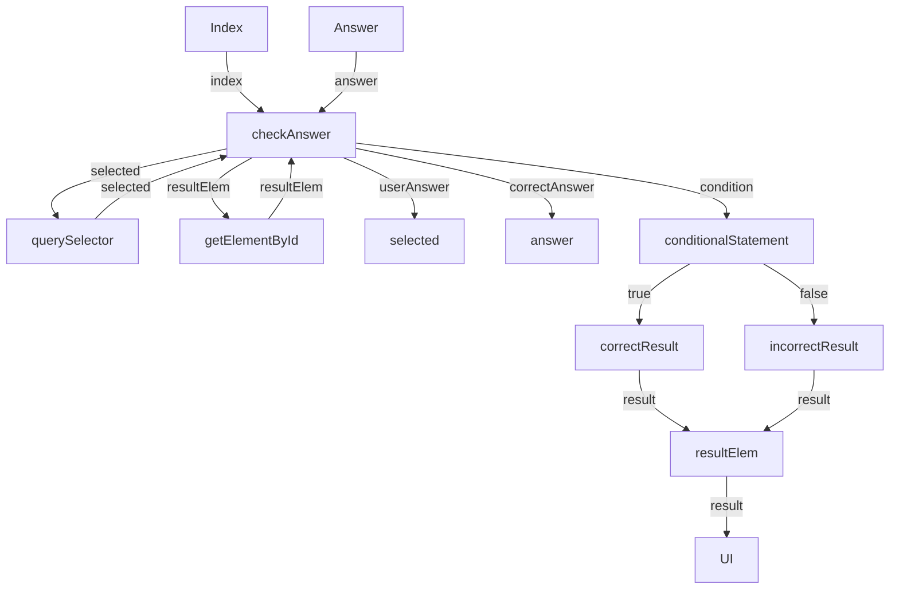

Here is the Mermaid.js flowchart that represents the data flow of the given JavaScript function:

This flowchart represents the data flow of the `checkAnswer` function, which takes in an `index` and an `answer` as inputs. It uses these inputs to query the selected radio button and the result element, and then compares the user's answer with the correct answer. Based on the condition, it updates the result element with either a correct or incorrect result, which is then displayed in the UI.