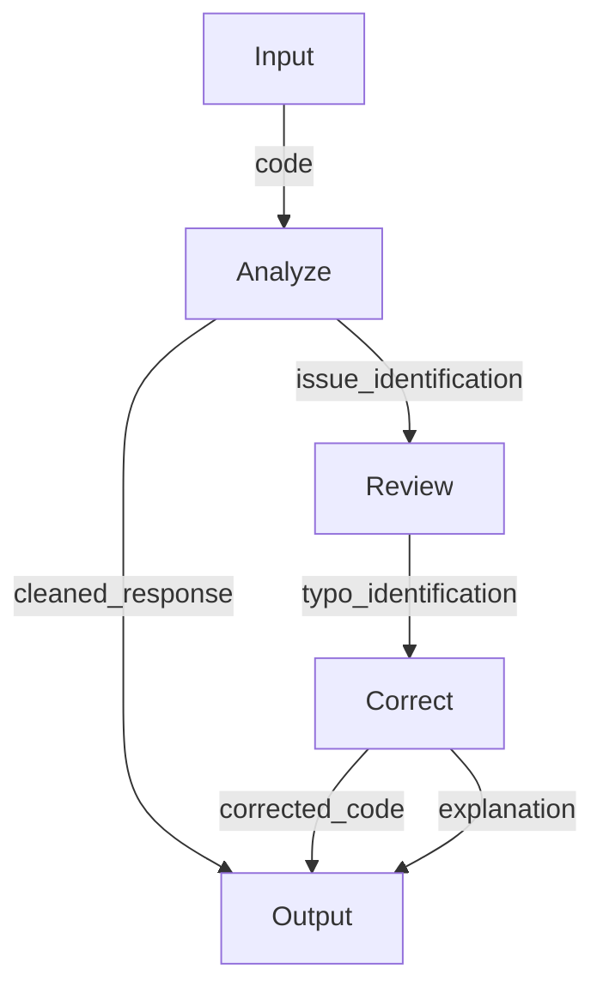

Here is the Mermaid.js flowchart that represents the data flow of the given Python code snippet:

This flowchart represents the data flow as follows:

* The input code is analyzed, which produces a cleaned response.
* The analysis also identifies the issue in the code, which is then reviewed.
* The review process identifies a typo in the code, which is then corrected.
* The corrected code and an explanation of the correction are output as the final result.